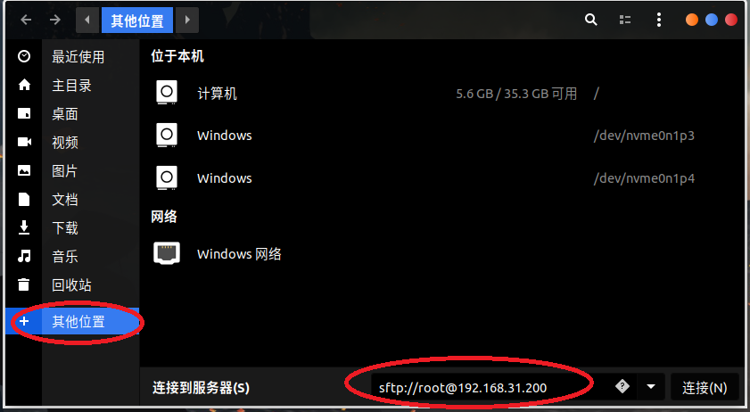
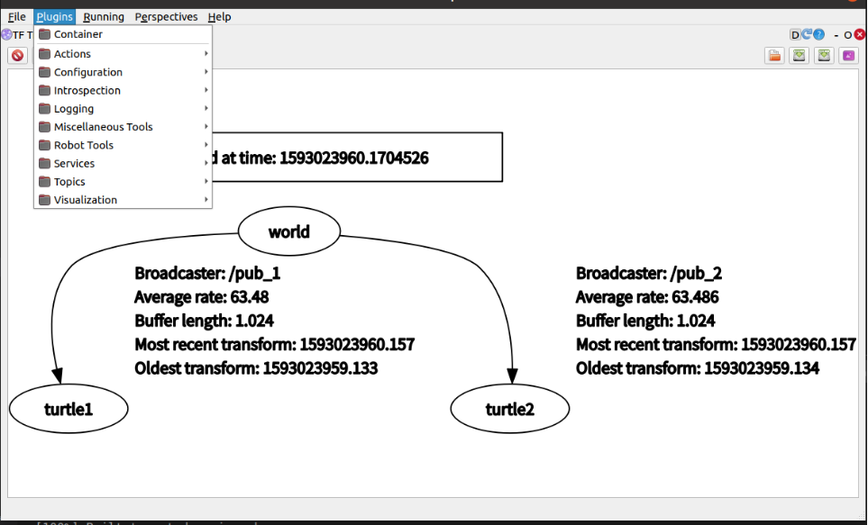
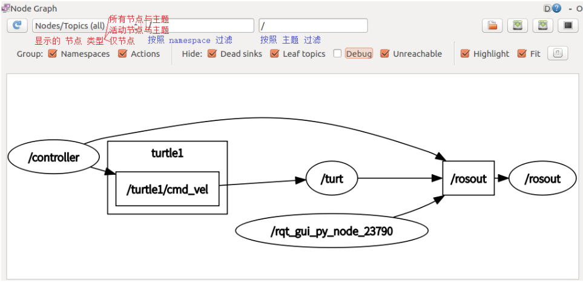
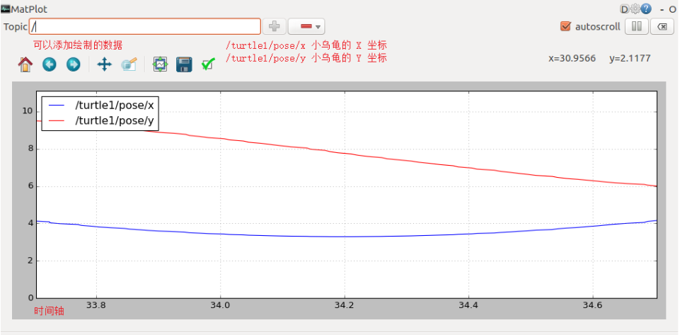

# ROS快速入门

## 资料链接

教学文档：[Introduction · Autolabor-ROS机器人入门课程《ROS理论与实践》零基础教程](http://www.autolabor.com.cn/book/ROSTutorials/)

参考视频：[【Autolabor初级教程】ROS机器人入门_哔哩哔哩_bilibili](https://www.bilibili.com/video/BV1Ci4y1L7ZZ/)

## Linux基本命令

参考链接：[(17条消息) Linux基本操作命令_daxiongbaobei的博客-CSDN博客_linux的基本命令](https://blog.csdn.net/daxiongbaobei/article/details/106671417)

​					[Linux 教程 | 菜鸟教程 (runoob.com)](https://www.runoob.com/linux/linux-tutorial.html)

以下为常用命令，具体参数和其余命令参考博客

---

***打开终端：CTRL + ALT + T***

---

### 1.查看及文件目录的命令

~~~powershell
pwd		    			显示当前路径
ls 		   	 			列出当前目录下文件
cd /bin     				进入bin目录
cd ..    	   				返回上级目录
roscd 功能包名			 进入功能包
~~~

### 2.创建目录和文件

~~~powershell
touch main.cpp			在当前路径下创建main.cpp文件
mkdir catkin_ws			创建catkin_ws文件夹
~~~

### 3.复制、删除、移动目录和文件

~~~powershell
cp –r test/ newtest  		将当前目录 test/ 下的所有文件复制到新目录 newtest 
rm  -r  * 			   删除当前目录下的所有文件及目录 
mv aaa bbb			   将文件 aaa 改名为 bbb 
mv info/ logs 		   将 info 目录放入 logs 目录中。注意，如果 logs 目录不存在，则该命令将 info 改名为 logs。
$ mv /usr/runoob/* 		   将 /usr/runoob 下的所有文件和目录移到当前目录下
~~~

### 4.查看文件

~~~powershell
sudo gedit main.cpp		以文本编辑器方式打开main.cpp。sudo命令表示以系统管理者的身份执行指令
sudo vim main.cpp			使用vim打开main.cpp
~~~

使用vim打开文件后，按i进入编辑模式，按esc推出编辑模式，:wq为保存退出，:q!为不保存强制退出。（w:保存，q:退出，!:强制）

### 5.安装、卸载

~~~powershell
sudo apt-get install ros-noetic-desktop-full		安装ros
sudo apt-get remove ros-noetic-*				   卸载ros
~~~

### 6.远程连接

~~~powershell
ssh root@192.168.0.1					远程连入
~~~

### 7.查看ip地址

~~~powershell
ifconfig
~~~

### 8.查看串口设备

~~~powershell
ll /dev/ttyUSB*
~~~

## ROS基本框架

### 1.文件系统

```powershell
WorkSpace --- 自定义的工作空间

|--- build:编译空间，用于存放CMake和catkin的缓存信息、配置信息和其他中间文件。

|--- devel:开发空间，用于存放编译后生成的目标文件，包括头文件、动态&静态链接库、可执行文件等。

|--- src: 源码

    |-- package：功能包(ROS基本单元)包含多个节点、库与配置文件，包名所有字母小写，只能由字母、数字与下划线组成

        |-- CMakeLists.txt 配置编译规则，比如源文件、依赖项、目标文件

        |-- package.xml 包信息，比如:包名、版本、作者、依赖项...(以前版本是 manifest.xml)

        |-- scripts 存储python文件

        |-- src 存储C++源文件

        |-- include 头文件

        |-- msg 消息通信格式文件

        |-- srv 服务通信格式文件

        |-- action 动作格式文件

        |-- launch 可一次性运行多个节点 

        |-- config 配置信息

    |-- CMakeLists.txt: 编译的基本配置
```

### 2.程序框架

~~~c++
#include "ros/ros.h"//包含头文件 

int main(int argc, char  *argv[])
{   
    ros::init(argc,argv,"talker");//初始化 ROS 节点:命名(唯一)
    ros::NodeHandle nh;//实例化 ROS 句柄
    /*
    	实例化 对象
    */
    ros::Rate r(10);//频率
    while (ros::ok()//节点不死)
    {
        /*
        	循环中执行主程序
        */
        r.sleep();//休眠
        ros::spinOnce()//如果程序中有回调函数加入这句
    }
    return 0;
}
~~~

> 若程序需要执行回调函数（如接收话题等），建议建`ros::spinOnce()`改为`ros::spin()`。并将`while`循环中的执行程序移至回调函数中。具体如下所示
>
> `ros::spin()`可不停地执行回调函数，避免有时因为循环频率丢包的问题。

```c++
#include "ros/ros.h"//包含头文件 
#include "std_msgs/String.h"//支持消息内容的文件

void doMsg(const std_msgs::String::ConstPtr& msg_p)
{
    /*
    	执行程序
    */
}

int main(int argc, char  *argv[])
{   
    ros::init(argc,argv,"talker");//初始化 ROS 节点:命名(唯一)
    ros::NodeHandle nh;//实例化 ROS 句柄
    ros::Subscriber sub = nh.subscribe<std_msgs::String>("chatter",10,doMsg);//实例化订阅话题对象
    ros::spin();//进入回调函数死循环
    return 0;
}
```

## ROS程序执行流程

### 1.创建功能包

~~~powershell
mkdir -p 自定义工作空间名/src
cd 自定义工作空间名
catkin_make
cd src
catkin_create_pkg 自定义功能包名 roscpp rospy std_msgs			
	- roscpp rospy std_msgs为功能包依赖项
	- roscpp c++编写ROS程序依赖
	- rospy python编写ROS程序依赖
	- std_msgs 标准消息依赖
~~~

### 2.编写程序

~~~powershell
cd 自定义功能包/src
touch main.cpp
~~~

### 3.配置CMakeLists.txt

***CMakeLists.txt文件中有注释，将注释放开进行修改***

***所有需要编译的c++文件都要执行以下配置，后面就不写了***

~~~cmake
add_executable(源文件名 src/源文件名.cpp)
target_link_libraries(源文件名 ${catkin_LIBRARIES})
~~~

### 4.编译运行

~~~powershell
cd 自定义工作空间
catkin_make												编译整个工作空间
	- catkin_make -DCATKIN_WHITELIST_PACKAGES="功能包名"		（单独编译一个功能包，记不住用tab补齐）
roscore													启动roscore//roscore一定要启动
source ./devel/setup.bash									 刷新环境变量（当前路径要在工作空间下）
rosrun 功能包名 c++节点										启动ros节点
~~~

## vscode配置

参考视频跟着配置就行了

## 话题通信

### 发布

~~~c++
include "功能包名/xxx.h"//发布自定义消息需添加msg编译生成的头文件（后面会讲）
//实例化 发布者 对象
//参数1: 要发布到的话题
//参数2: 队列中最大保存的消息数，超出此阀值时，先进的先销毁(时间早的先销毁)
ros::Publisher pub = nh.advertise<std_msgs::String>("话题名",10);
//组织被发布的数据，并编写逻辑发布数据
//数据(动态组织)
std_msgs::String msg;
demo01::xxx a;//创建自定义消息对象a，为demo01为功能包名，xxx为msg文件名
a.cmd = 50;//为对象a中的成员赋值
//发布消息
pub.publish(msg);
pub.publish(a);//将对象a发布
~~~

### 接受

~~~c++
//实例化 订阅者 对象
//参数3：接受到消息后进入的回调函数
ros::Subscriber sub = nh.subscribe<std_msgs::String>("chatter",10,doMsg);
//如果为自定义消息，将<>中改为自定义消息类型，如：<demo01::Person>
//程序中有回调函数时需要加入ros::spin()或ros::spinOnce()
~~~

回调函数：

```cpp
void doMsg(const std_msgs::String::ConstPtr& msg_p)
/*
	括号中的参数为接受到的消息类型的指针引用
	如果为自定义消息则为const demo01::Person::ConstPtr& person_p
		//demo01为功能包名，Person为msg文件名
*/
{
    /*
    	处理信息，如：
    	ROS_INFO("%s",msg_p->data.c_str());
    */
} 
```

### ros::spin()和ros::spinOnce()区别 

参考[(17条消息) ros::spin()、ros::spinOnce()：使用细节、区别_默_存的博客-CSDN博客_ros::spinonce](https://blog.csdn.net/weixin_40215443/article/details/103793316)

* 对于spin函数，一旦进入spin函数，它就不会返回了，也不继续往后执行了，相当于它在自己的函数里面死循环了（直到ctrl+c　或者程序终止的时候才退出）。
* 当spinOnce函数被调用时，spinOnce就会调用回调函数队列中第一个callback函数，此时callback函数被执行。spinOnce函数执行一次后，接着执行下面的语句。不像spin函数，进入到自己的内部循环，不往下执行。等到下次spinOnce函数又被调用时，回调函数队列中第二个callback函数就会被调用，以此类推。在while循环中使用

~~~c++
while(ros::OK())
{
    /*
    	做其他事
    */
    ros::spinOnce();
}
~~~

## 自定义消息

### 1.定义msg文件

功能包下新建 msg 目录，添加文件 Person.msg			（Person为自定义消息文件名）

在 msg 文件中写入自定义消息，如：

~~~c++
int32 a				//int32类型的变量a
string b
float32 c
~~~

可以使用的字段类型有：

* int8, int16, int32, int64 (或者无符号类型: uint*)
* float32, float64
* string
* time, duration
* other msg files
* variable-length array[] and fixed-length array[C]

### 2.编辑配置文件

#### *package.xml*

~~~xml
  <build_depend>message_generation</build_depend>			//添加编译依赖
  <exec_depend>message_runtime</exec_depend>				//添加执行依赖
~~~

#### *CMakeLists.txt*

~~~cmake
# 需要加入 message_generation,必须有 std_msgs （在原有的roscpp等依赖上追加）
find_package(catkin REQUIRED COMPONENTS
  std_msgs
  message_generation
)
~~~

~~~cmake
## 配置 msg 源文件
add_message_files(
  FILES
  Person.msg
  xxx.msg				//如果还有继续添加
)
~~~

~~~cmake
# 生成消息时依赖于 std_msgs
generate_messages(
  DEPENDENCIES
  std_msgs
)
~~~

~~~cmake
#执行时依赖
catkin_package(
#  INCLUDE_DIRS include
#  LIBRARIES demo02_talker_listener
  CATKIN_DEPENDS roscpp rospy std_msgs message_runtime				//把这行的注释放开
#  DEPENDS system_lib
)
~~~

### 3.编译

在工作空间下成过编译后会生成头文件，位于(.../工作空间/devel/include/包名/xxx.h)，可查看该文件是否生成用于确认。

## 服务通信

### 1.定义srv文件

功能包下新建 srv 目录，添加 xxx.srv 文件，内容:

~~~c++
int32 num1
int32 num2
---			//三条短线分割客户端和服务端数据，上面为客户端请求数据，下面为服务器响应数据
int32 sum
~~~

### 2.编辑配置文件

#### *package.xml*

和自定义消息一样

#### *CMakeLists.txt*

~~~cmake
# 需要加入 message_generation,必须有 std_msgs （在原有的roscpp等依赖上追加）
find_package(catkin REQUIRED COMPONENTS
  std_msgs
  message_generation
)
~~~

~~~cmake
add_service_files(
  FILES
  AddInts.srv	//添加的自定义srv文件
)
~~~

~~~cmake
generate_messages(
  DEPENDENCIES
  std_msgs
)
~~~

### 3.编译

在工作空间下成过编译后会生成头文件，位于(.../工作空间/devel/include/包名/xxx.h)，可查看该文件是否生成用于确认。

### 4.程序

#### 客户端

~~~c++
//添加头文件
#include "demo03_server_client/AddInts.h"
//创建 客户端 对象
ros::ServiceClient client = nh.serviceClient<demo03_server_client::AddInts>("AddInts");
//等待服务启动成功
client.waitForExistence();
//组织请求数据
demo03_server_client::AddInts ai;
ai.request.num1 = 1;//ai.request表示客户端请求数据，ai.response表示服务端响应数据
ai.request.num2 = 2;
//发送请求,返回 bool 值，标记是否成功
bool flag = client.call(ai);
//处理响应
if (flag)
{
    ROS_INFO("请求正常处理,响应结果:%d",ai.response.sum);
}
else
{
    ROS_ERROR("请求处理失败....");
    return 1;
}
~~~

#### 服务端

~~~c++
//添加头文件
#include "demo03_server_client/AddInts.h"
// 4.创建 服务 对象
ros::ServiceServer server = nh.advertiseService("AddInts",doReq);
ros::spin();//循环调用
~~~

回调函数：

~~~c++
bool doReq(demo03_server_client::AddInts::Request& req,demo03_server_client::AddInts::Response& resp)
/*
	括号中的参数为接受到的消息类型的请求和响应数据的指针引用
*/
{
    //接受客户端请求数据
    int num1 = req.num1;
    int num2 = req.num2;
    ROS_INFO("服务器接收到的请求数据为:num1 = %d, num2 = %d",num1, num2);
    //逻辑处理
    if (num1 < 0 || num2 < 0)
    {
        ROS_ERROR("提交的数据异常:数据不可以为负数");
        return false;
    }
    //如果没有异常，那么相加并将结果赋值给 resp
    resp.sum = num1 + num2;
    return true;
}
~~~

## ACTION通信

### 1.定义action文件

新建功能包时需导入依赖: `actionlib actionlib_msgs`，没导入的后面配置CMakeLists.txt文件

功能包下新建 action 目录，新增 xxx.action(比如:AddInts.action)。

~~~cmake
#目标值
int32 num
---
#最终结果
int32 result
---
#连续反馈
float64 progress_bar
~~~

### 2.编辑配置文件

#### *CMakeLists.txt*

~~~cmake
find_package# 加入action依赖
(catkin REQUIRED COMPONENTS
  std_msgs
  actionlib
  actionlib_msgs
)
~~~

~~~cmake
add_action_files(
  FILES
  AddInts.action
)
~~~

~~~cmake
generate_messages(
  DEPENDENCIES
  std_msgs
  actionlib_msgs
)
~~~

~~~cmake
catkin_package(
#  INCLUDE_DIRS include
#  LIBRARIES demo04_action
 CATKIN_DEPENDS roscpp rospy std_msgs actionlib actionlib_msgs
#  DEPENDS system_lib
)
~~~

### 3.编译

在工作空间下成过编译后会生成头文件，位于(.../工作空间/devel/include/包名/xxx.h)，可查看该文件是否生成用于确认。

### 4.程序

#### 客户端

~~~c++
#include "actionlib/client/simple_action_client.h"//导入action客户端文件
#include "demo01_action/AddIntsAction.h"//导入自定义action文件
typedef actionlib::SimpleActionClient<demo01_action::AddIntsAction> Client;//比较长，先重命名
//创建action客户端对象;
Client client(nh,"addInts",true);
//等待服务启动
client.waitForServer();
//实例化对象并赋值
demo01_action::AddIntsGoal goal;
goal.num = 10;
client.sendGoal(goal,&done_cb,&active_cb,&feedback_cb);//调用action服务
//三个参数都是函数指针，下面具体说明
ros::spin();
~~~

回调函数：

~~~c++
//服务启动时会调用此函数
void active_cb()
{
    ROS_INFO("服务已经被激活....");
}
~~~

~~~c++
//处理连续反馈，在处理过程不不断调用
void  feedback_cb(const demo01_action::AddIntsFeedbackConstPtr &feedback)
{
    ROS_INFO("当前进度:%.2f",feedback->progress_bar);
}
~~~

~~~c++
//处理最终结果，结束后调用
void done_cb(const actionlib::SimpleClientGoalState &state, const demo01_action::AddIntsResultConstPtr &result)
{
    if (state.state_ == state.SUCCEEDED)
    {
        ROS_INFO("最终结果:%d",result->result);
    }
    else
    {
        ROS_INFO("任务失败！");
    }

}
~~~

#### 服务端

~~~c++
#include "actionlib/server/simple_action_server.h"//导入action服务端文件
#include "demo01_action/AddIntsAction.h"//导入自定义action文件
typedef actionlib::SimpleActionServer<demo01_action::AddIntsAction> Server;//重命名
//创建action服务对象;
Server server(nh,"addInts",boost::bind(&cb,_1,&server),false);
server.start();//启动服务
ros::spin();//循环
~~~

回调函数：

~~~c++
void cb(const demo01_action::AddIntsGoalConstPtr &goal,Server* server)
{
    //获取目标值
    int num = goal->num;
    ROS_INFO("目标值:%d",num);
    //累加并响应连续反馈
    int result = 0;
    demo01_action::AddIntsFeedback feedback;//连续反馈
    ros::Rate rate(10);//通过频率设置休眠时间
    for (int i = 1; i <= num; i++)
    {
        result += i;
        //组织连续数据并发布
        feedback.progress_bar = i / (double)num;
        server->publishFeedback(feedback);
        rate.sleep();
    }
    //设置最终结果
    demo01_action::AddIntsResult r;
    r.result = result;
    server->setSucceeded(r);
    ROS_INFO("最终结果:%d",r.result);
}
~~~

## 参数服务器

### 新增/修改参数

~~~c++
//NodeHandle--------------------------------------------------------
ros::NodeHandle nh;
nh.setParam("nh_int",10); //整型
nh.setParam("nh_double",3.14); //浮点型
//修改(相同的键，不同的值)
nh.setParam("nh_int",10000);

//param----------------------------------------------------------
ros::param::set("param_int",20);
ros::param::set("param_double",3.14);
//修改(相同的键，不同的值)
ros::param::set("param_int",20000);

//接受--------------------------------------------------------------
int res1 = nh.param("nh_int",100);
int res2 = ros::param::param("param_int",20); //存在
~~~

### 常用ROS命令

~~~powershell
rosnode list    列出活动节点
rosnode info    打印节点信息
rosnode kill    杀死某个节点
~~~

~~~powershell
rostopic echo   打印消息到屏幕
rostopic hz     显示主题的发布频率
rostopic info   显示主题相关信息
rostopic list   显示所有活动状态下的主题
rostopic pub    将数据发布到主题
rostopic type   打印主题类型
例：
rostopic pub /turtle1/cmd_vel geometry_msgs/Twist
 "linear:
  x: 1.0
  y: 0.0
  z: 0.0
angular:
  x: 0.0
  y: 0.0
  z: 2.0"
//只发布一次运动信息
rostopic pub -r 10 /turtle1/cmd_vel geometry_msgs/Twist
 "linear:
  x: 1.0
  y: 0.0
  z: 0.0
angular:
  x: 0.0
  y: 0.0
  z: 2.0"
// 以 10HZ 的频率循环发送运动信息
~~~

~~~powershell
rosmsg show    显示消息描述
rosmsg info    显示消息信息
rosmsg list    列出所有消息
~~~

~~~powershell
rosservice args    打印服务参数
rosservice call    使用提供的参数调用服务
rosservice info    打印有关服务的信息
rosservice list    列出所有活动的服务
rosservice type    打印服务类型
~~~

~~~powershell
rossrv show    显示服务消息详情
rossrv info    显示服务消息相关信息
rossrv list    列出所有服务信息
~~~

~~~powershell
rosparam set    设置参数
rosparam get    获取参数
rosparam delete    删除参数
rosparam list    列出所有参数
~~~

## launch文件

### 1.编写launch文件

功能包下新建 launch 目录，新增 xxx.launch(比如 test.launch )。

~~~xml
<!-- 注意" / "不要漏掉，不然会报错 -->
<launch>
    <!-- 启动某功能包下的节点,args为参数（可选） -->
    <node pkg="功能包" type="节点" name="节点名" />
    <node pkg="teleop_twist_keyboard" type="teleop_twist_keyboard.py" name="key" args=""/>
    <!-- 启动其他launch文件，$(find 功能包)为寻找功能包指令 -->
    <include file="$(find 功能包)/launch/xxx.launch" />
    <include file="$(find learning_launch)/launch/simple.launch" />
    <!-- 设置参数 -->
    <param name="p1" value="100" />
</launch>
~~~

### 2.启动

~~~c++
roslaunch demo01 test.launch
/*
	启动功能包下的launch文件
	启动launch文件时会自动启动roscore，无需手动启动
	启动时会将launch文件中所有的节点集成在一个终端中启动
*/
~~~

## 多机通信

### 终端连入

***前提条件：本机和远程连接的机器在同一个局域网下***

~~~powershell
ssh root@192.168.31.200
password:
~~~

输入密码后即可连入*root@192.168.31.200*中，*root*为计算机名，*192.168.31.200*为IP地址。

连入后在该终端进行的操作都是在*root@192.168.31.200*中进行的。即可在本机启动远程终端的ros节点

### 文件夹连入



连接成功后即可在文件资源管理其中远程操作文件

## rqt工具箱

### 启动

~~~powershell
rqt		终端输入rqt可直接启动,可在Plugins下添加插件
~~~



### 常用插件

#### rqt_graph

查看节点关系图



#### rqt_plot

查看数据变化



#### rqt_bag

录制、重放

---

下面主要为路径规划内容***（过段时间补上）***

---

## TF坐标变换


## 机器人模型

### URDF

### XACRO

### RVIZ

## 导航

## slam建图

## 地图服务

## 定位

## 路径规划

---

## ROS与STM32通信

参考链接：[(17条消息) 【ROS、STM32】ROS与STM32通信_亦乐大大的博客-CSDN博客_stm32与ros](https://blog.csdn.net/weixin_45417246/article/details/115587952?ops_request_misc=%7B%22request%5Fid%22%3A%22166970146516782425169366%22%2C%22scm%22%3A%2220140713.130102334..%22%7D&request_id=166970146516782425169366&biz_id=0&utm_medium=distribute.pc_search_result.none-task-blog-2~all~top_click~default-2-115587952-null-null.142^v67^control,201^v3^control,213^v2^t3_esquery_v3&utm_term=ros与stm32串口通信&spm=1018.2226.3001.4187)

​				[(17条消息) ROS使用serial包进行串口通信_杰尼君的博客-CSDN博客_ros serial包](https://blog.csdn.net/weixin_44444810/article/details/120827387)

